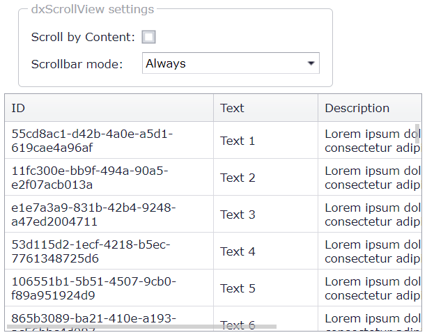

<!-- default badges list -->

[](https://supportcenter.devexpress.com/ticket/details/T532374)
[](https://docs.devexpress.com/GeneralInformation/403183)
<!-- default badges end -->
# Grid View for ASP.NET MVC - How to replace default browser scrollbars with the dxScrollView widget
<!-- run online -->
**[[Run Online]](https://codecentral.devexpress.com/128550923/)**
<!-- run online end -->

This example demonstrates how to apply the **dxScrollView** widget to the grid to configure the grid's scrolling capability.



## Overview

Set the grid's [HorizontalScrollBarMode](https://docs.devexpress.com/AspNet/DevExpress.Web.ASPxGridSettings.HorizontalScrollBarMode) and [VerticalScrollBarMode](https://docs.devexpress.com/AspNet/DevExpress.Web.ASPxGridSettings.VerticalScrollBarMode) properties to `Auto` to enable horizontal and vertical scrolling. To display a vertical scrollbar, specify the grid's [VerticalScrollableHeight](https://docs.devexpress.com/AspNet/DevExpress.Web.ASPxGridSettings.VerticalScrollableHeight) property.

```cshtml
var grid = Html.DevExpress().GridView(settings => {
    <!-- ... -->
    settings.Settings.HorizontalScrollBarMode = ScrollBarMode.Auto;
    settings.Settings.VerticalScrollBarMode = ScrollBarMode.Auto;
    settings.Settings.VerticalScrollableHeight = 200;
    <!-- ... -->
});
```

Apply the **dxScrollView** widget to the `dxgvCSD` element on the first grid load and after a callback:

```js
unction InitializeScrollView() {
    GetScrollableElement().dxScrollView({
        showScrollbar: 'always',
        direction: 'both',
        scrollByContent: IsScrollByContent.GetChecked(),
        showScrollbar: ShowScrollBar.GetValue(),
        onScroll: function (e) {
            $('.dxgvHSDC .dxgvTable_DevEx').css('transform', 'translateX(' + (-e.scrollOffset.left) + 'px)');
        }
    });
    AdjustHeaderElement();
}

function GetScrollableElement() {
    return $('.dxgvCSD', GridView.GetMainElement());
}
function AdjustHeaderElement() {
    $('.dxgvHSDC')[0].style.paddingRight = '';
    var headerScrollElement = $('.dxgvHSDC > div')[0];
    headerScrollElement.style.width = (GridView.GetMainElement().offsetWidth - 2) + 'px';
}

function OnGridViewInit(s, e) {
    InitializeScrollView();
}

function OnGridViewEndCallback(s, e) {
    InitializeScrollView();
}
```

## Files to Review

* [scripts.js](./CS/GridViewWithDxScrollView/Scripts/scripts.js) (VB: [scripts.js](./VB/GridViewWithDxScrollView/Scripts/scripts.js))
* [_GridViewPartial.cshtml](./CS/GridViewWithDxScrollView/Views/Home/_GridViewPartial.cshtml)

## Documentation

* [Vertical Scrolling](https://docs.devexpress.com/AspNetMvc/16903/components/grid-view/focus-and-navigation/paging-and-scrolling/vertical-scrolling)
* [Horizontal Scrolling](https://docs.devexpress.com/AspNetMvc/16905/components/grid-view/focus-and-navigation/paging-and-scrolling/horizontal-scrolling)
